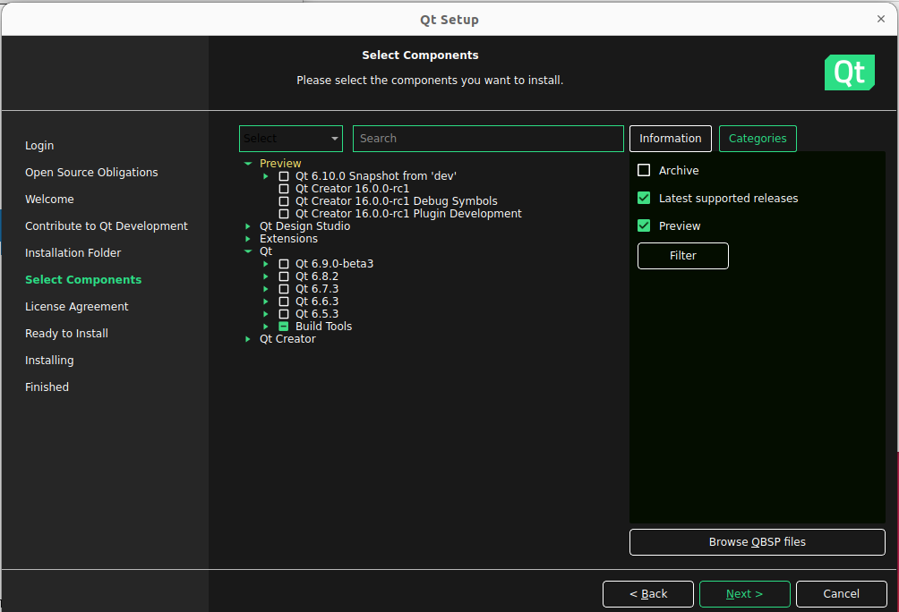
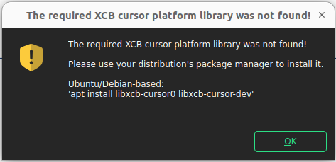

# 项目介绍

本项目基于 [LabelRoboMaster](https://github.com/MonthMoonBird/LabelRoboMaster) 开源项目进行开发。  

## 改进
我们对 YOLOv11 所需的输入标签格式进行了适配，并对输出格式进行了调整。调整后的格式为：
```
<目标id> [bbox的xywh] [目标各点的x、y归一化坐标]
```
具体使用方法，请参考 [使用教程](https://github.com/MonthMoonBird/LabelRoboMaster/blob/main/README.md)。

## 感谢

感谢[上海交通大学交龙战队](https://github.com/SJTU-RoboMaster-Team) [xinyang](https://github.com/xinyang-go) 、 [哈尔滨工业大学深圳校区南工骁鹰战队](https://space.bilibili.com/1559398123/)  [MonthMoonBird](https://github.com/MonthMoonBird) 提供的开源项目，使我们能够在其基础上进行改进与开发。我们将继续在此基础上进行优化，并分享更多的功能与改进。

## 安装教程
> 本指南使用 ubuntu22.04 + OpenCV  + QT 配置和使⽤该⼯具

### **QT安装**
1.  打开终端输入
```
sudo apt install qt5-default
sudo apt install libqt5svg5-dev
```

2. 在[官网](https://d13lb3tujbc8s0.cloudfront.net/onlineinstallers/qt-unified-linux-x64-4.5.2-online.run)或[清华源](https://mirrors.tuna.tsinghua.edu.cn/qt/official_releases/online_installers/qt-unified-linux-x64-online.run)下载 QT 的在线安装包
3. 在下载⽬录下打开终端，隔⾏依次键⼊:
```s
chmod +x qt-unified-linux-x64-online.run
./qt-unified-linux-x64-online.run --mirror \
https://mirrors.tuna.tsinghua.edu.cn/qt  # 使用清华源安装
```
4. 在打开的安装窗⼝中⼀路按照提⽰安装 QT ，其中在安装文件夹中如下图选择：

在选择组件中仅选择Qt-Qt5.15.2-Desktop gcc 64-bit就好 
 
如果如下图所示如果没有5.15.2版本，请勾选右侧"Archive"，再点击"Filter"按钮，即可找到Qt  5.15.2  

如果如下图所示出现报错，按照要求输入即可 
```s
sudo apt install libxcb-cursor0 libxcb-cursor-dev
``` 

### **opencv安装**
请自行安装

### **其它依赖库安装**
QT的编译依赖 OpenGL 库，需⼿动安装，打开终端，键⼊:
```s
sudo apt install libgl1-mesa-dev
sudo apt install libglu1-mesa-dev freeglut3-dev
```
同时，编译需要 git cmake build-essential 等库，打开终端，键⼊:
```s
sudo apt install git vim cmake-qt-gui build-essential
```

### **下载源码编译**
1. 在合适的安装⽬录下(⽐如 ~)下打开终端，键⼊:
```s
git clone https://github.com/MonthMoonBird/LabelRoboMaster.git
```
2. 打开 CMakeLists.txt ， 模仿图中在第8行添加 Cmake 设置:
```s
set(CMAKE_PREFIX_PATH "你的QT安装⽬录/QT版本/gcc_64")
```

保存并关闭

3. 编译运行
- 配置

在源码目录下打开终端，键⼊
```s
mkdir build
cd build
cmake ..
```
出现如下提⽰说明配置成功

- 编译

在终端键⼊
```s
make
```
出现如下提⽰说明编译成功

- 运行

在终端键⼊
```s
./LabelRoboMaster
```
出现LabelMaster窗口说明安装成功